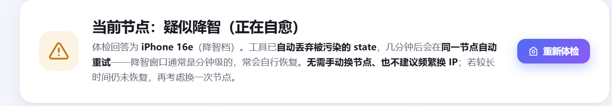
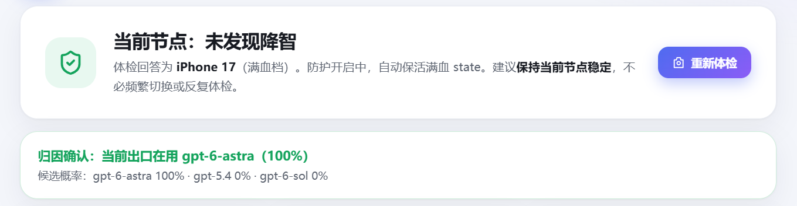

# ccodex-sleep-plus

Codex 降智检测与自愈的本地常驻工具：出口质量体检、满血 state 保活、降智自动隔离与同出口自愈。基于 [gylive/ccodex-sleep-state](https://github.com/gylive/ccodex-sleep-state) 社区思路的独立增强实现。

## 下载安装（Windows）

**→ [下载安装包 ccodex-sleep-plus-setup.exe](https://github.com/wachg-studio/ccodex-sleep-plus/releases/download/v1.1.0/ccodex-sleep-plus-setup.exe)**　（约 47 MB，[全部版本](https://github.com/wachg-studio/ccodex-sleep-plus/releases)）

三步上手：

1. 双击安装——自动识别 Codex 位置与本机代理，创建桌面快捷方式
2. **重启 Codex**（桌面版/CLI 均可），新会话即被防护
3. 托盘常驻后台；右键托盘 →「打开状态面板」，点「重新体检」实测当前节点是否降智

卸载：开始菜单「卸载 ccodex sleep plus」或 `ccodex-sleep-plus.exe uninstall`（自动恢复 Codex 原始配置）。

> 注意：体检/采集探针会消耗少量真实额度（每日上限 200 次，防失控）；社区思路，不保证效果；不建议频繁更换代理节点（可能增加风控风险），满血后保持节点稳定即可。

## 它会主动做什么

- **出口质量体检**：知识新鲜度探针（答 iPhone 17 = 满血 / 16 = 降智 / 15 = 严重降智）实测每个出口的真实 serving 档位；采集与质检合并为一次请求
- **满血 state 保活**：默认每 10 分钟自动探针（可调 5/30 分钟或关闭），出口满血时把最新 state 刷进注入池，正式请求始终注入刚验证过的满血 state，避免新会话冷启动被降
- **降智自动隔离 + 同出口自愈**：检测到降智立即丢弃被污染的 state（绝不注入降智链路），5 分钟内同出口自动重试——上游裁决窗口是分钟级的，常自行恢复，**不依赖换节点**
- **turn-state 采集注入**：10/12 块（292/332）+ 33 块（780）官方新形状（[issue #13](https://github.com/gylive/ccodex-sleep-state/issues/13)）；多实例池、指纹去重、临期续采
- **效果观测**：旁路记录注入开/关的自报模型与 token 用量对比，用数据检验是否有效
- **深度归因（ModelTrace）**：面板手动触发，发 3 条长整数挑战做数字指纹归因（[xqy2006/ModelTrace](https://github.com/xqy2006/ModelTrace)，MIT，纯标准库移植），在 8 个候选模型（含 gpt-6-astra / gpt-5.6-luna 等"降智替身"）中判定当前出口实际服务的模型身份；归因失配直接触发隔离与自愈——比知识探针更硬的证据，成本为 3 次完整生成
- **工程化**：托盘常驻（DPI 清晰、菜单控制一切）、独立面板窗口（不占浏览器）、崩溃弹窗+日志、网关监督自启、配置自愈、失败指数退避、Inno Setup 正规安装/卸载

## 用户反馈

> "实测真实有效，几分钟就从降智状态升级为满血，并且模型百分百是 GPT-6astra，非常值得一试。" —— 2026-09-27 用户实测

| 自愈过程：降智 → 满血（近 3 次判定：满·满·归因确认） | 深度归因确认模型身份 |
| --- | --- |
|  |  |

*个体体验不代表普遍效果；面板中"归因 gpt-6-astra 100%"指 ModelTrace 数字指纹在 8 模型闭集内的归因概率。*

## 社区调研结论（2026-09-27）

- **33 块（780 字符）是 2026-09-22 后的官方新形状**，不是降智标记
- **降智由上游按"账号 × 出口 IP × 分钟级时间窗"裁决**（[ccodex-rotate](https://github.com/446599/ccodex-rotate) 的行为归因结论），与 state 形状无关；这正是本工具"同出口自愈"策略的依据
- 注入窗口可能只有约 240 秒（同上）；`response.created.model` 字段可能失真，token 用量更可靠
- 质量探针方法来自 [csss](https://github.com/tzf1003/csss)；跨会话缓存思路参考 [CheckClaude](https://github.com/zzusec/CheckClaude)

## 机制与边界

- 只处理 Responses HTTP/SSE；不支持 WebSocket
- state 封装校验：`0x80` 头 + 8 字节大端时间戳 + 48 字节固定头 + N×16 字节密文块（base64url）；TTL 1 小时
- 401/403 封锁凭据、429 按 Retry-After 暂停；不通过换出口绕过上游限制
- 认证值与完整 state 不写日志；面板仅本机回环可访问；凭据只留内存
- 代理出口支持 HTTP CONNECT / SOCKS5（纯标准库实现），自动发现系统代理/常见本地端口

## 源码运行与开发

```powershell
pip install pystray pillow pywebview pyinstaller
python sleep_plus.py install     # 安装器：识别 + 快捷方式 + 启动
python sleep_plus.py probe       # 单次试采（消耗一次极短请求）
python test_gateway.py           # 集成测试 33 项（mock 上游，零额度）
python sleep_plus.py selftest    # 单元自检
python build_exe.py              # PyInstaller onedir 打包
ISCC installer.iss               # Inno Setup 制作安装包（输出 setup/）
```

## 致谢与许可

思路与经验规则来自 [gylive/ccodex-sleep-state](https://github.com/gylive/ccodex-sleep-state)（GPL-3.0）及其社区讨论，并参考 [ccodex-rotate](https://github.com/446599/ccodex-rotate)、[csss](https://github.com/tzf1003/csss)、[CheckClaude](https://github.com/zzusec/CheckClaude)。GPL-3.0，见 [LICENSE](LICENSE)。本项目与 OpenAI 无隶属关系。
